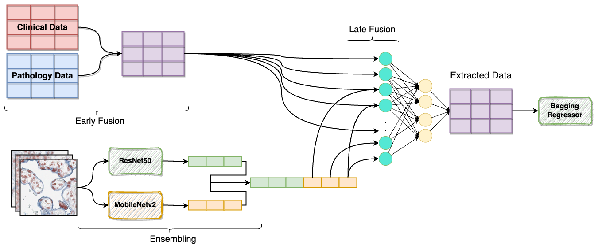
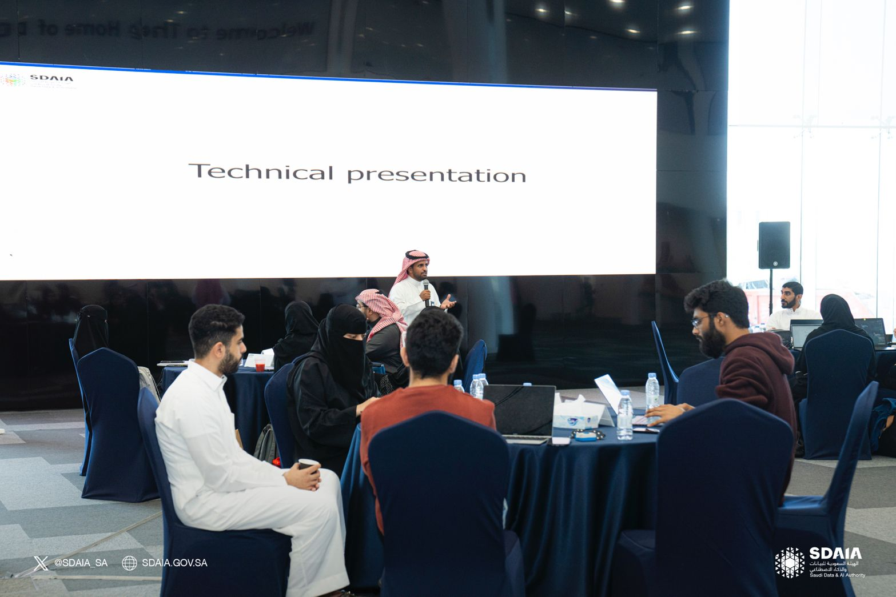
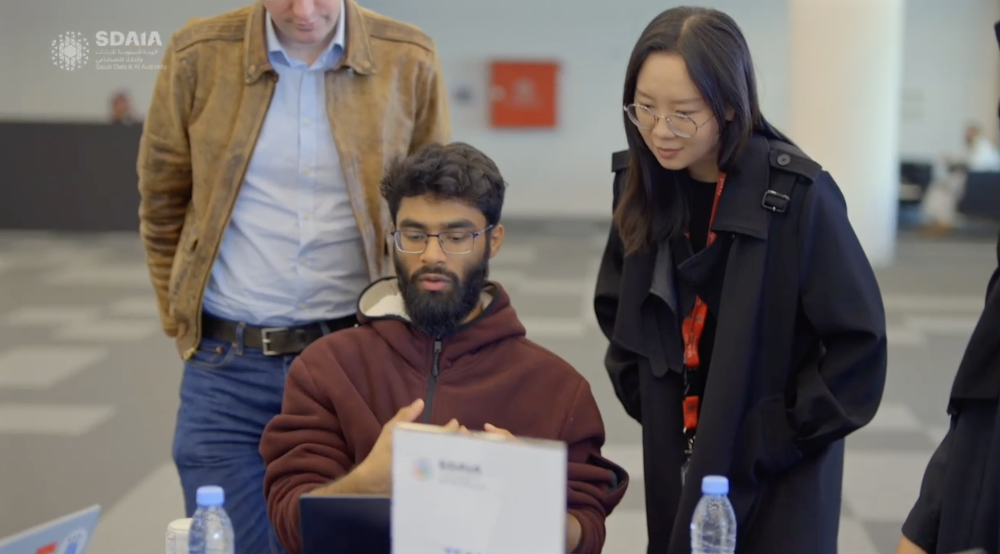

## Hackathon Data: Multimodal integration of radiology, pathology, and genomics for prediction of Progression Free Survival (PFS) in patients with non-small cell lung cancer

This project was my submission for a hacakthon held by the Saudi Authority for Data and Artificial Intelligence (SDAIA) in collaboration with Stanford.

### Data

The data belongs to the following publication [Multimodal integration of radiology, pathology and genomics for prediction of response to PD-(L)1 blockade in patients with non-small cell lung cancer](https://www.nature.com/articles/s43018-022-00416-8). [Synapse](https://www.synapse.org/#!Synapse:syn26642505/wiki/615361).

### Approach

My team and I utilized the clinical data, extracted pathology features and pathology images of lung tissue to predict Progression Free Survival (PFS).
Our approach employs both early fusion and late fusion for the stated objective of predicting PFS. 

Our complete approach is shown in ppt.pdf
The image below illustrates our final approach.  

  

### Images from the hackathon

  
  
  